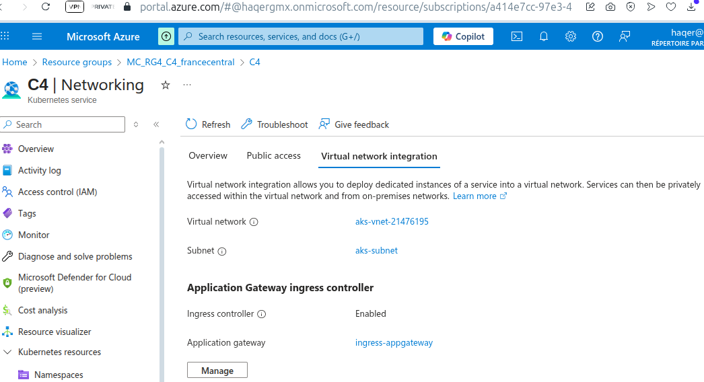

# 5.2.1) JBoss Cluster High Availability Demo on AKS (taking advantage of free trial)
This demonstrates the [Replication](../../README.md#33-replication-on-kubernetes) approach on AKS,
with Kube-ping-based clustering.

## 5.2.1.1) Building, Testing, Using & Publishing Kube-Ping-Based Deployment Artifacts (Locally)
To start k8s locally, one can use commands `systemctl` & `minikube` as discussed on top of
[Welcome Page](../../README.md). Plus, optionally:

```console
minikube status -p jboss-cluster-hi-availability-demo
```
The simplest way to (re)build webapp:

```console
mvn -DskipTests -Popenshift clean package wildfly:image
```
Then build the app container Docker image using 1 of the 2 following commands:

```console
src/main/docker/jboss-cluster-replication-demo_on_widlfly/build.sh

docker build -f src/main/docker/jboss-cluster-replication-demo_on_widlfly/Dockerfile \
	--tag jboss-cluster-hi-availability-demo:0.9 --rm=true .
```
### 5.2.1.1.1) Publication
I published it as follows (& you could skip this step & just use the published artifact):

```console
imageAndTag=jboss-cluster-hi-availability-demo:0.9
docker tag $imageAndTag adazes/$imageAndTag
docker login -u adazes docker.io
docker push adazes/$imageAndTag
```
### 5.2.1.1.2) Deploying, Using & Testing Locally
Please follow the same steps as in section
[3.3) Replication on Kubernetes](../../README.md#33-replication-on-kubernetes) on the main page.

## 5.2.1.2) Deploying on AKS
### 5.2.1.2.1) Making a Cluster
#### 5.2.1.2.1.1) Automatically
Might result in incompatible architecture (ARM64), but might be worth trying:

```console
source src/test/bash/provider/az/env.sh
src/test/bash/provider/az/new-group+cluster.sh
```
If arch isn't AMD64 or Network configuration isnt something like Azure CNI Node Subnet allowing
AGIC, consider Using manual approach described in the next sub-section.

#### 5.2.1.2.1.2) Manually
##### 5.2.1.2.1.2.1) Free.
From portal:

* Resource groups: + Create
* Create a Resource -> Kubernetes -> AKS -> Create -> Resource group, Cluster -> Next, etc.

###### 5.2.1.2.1.2.1.1) During.
* Node Pools -> Click link under Node size -> Select (size) Standard_D2s_v3: Or another option with
AMD64 architecture.
* Networking -> Network configuration -> Select Azure CNI Node Subnet: For AGIC.

###### 5.2.1.2.1.2.1.2) After.
Enable AGIC addon:



##### 5.2.1.2.1.2.2) Paid.
```console
az aks create \
  --resource-group <nom_du_groupe_de_ressources> \
  --name <nom_du_cluster> \
  --location <emplacement> \
  --node-count <nombre_de_noeuds> \
  --node-vm-size Standard_D2s_v3 \
  --generate-ssh-keys
```
##### 5.2.1.2.1.2.3) If Using Cloud Shell: Transferring files.
From portal toolbar:
* Cloud Shell
    - Manage files
        - Upload
      - Open file share

##### 5.2.1.2.1.2.4) Set environment variables.
From Cloud Shell:

```console
source src/test/bash/provider/az/env-manual.sh
src/test/bash/provider/az/env-print.sh
```

or

```console
RESOURCE_GROUP_NAME=RG4
AKS_CLUSTER_NAME=C4
# ...
```

### 5.2.1.2.2) Preparing kubectl
```console
az aks get-credentials --resource-group $RESOURCE_GROUP_NAME --name $AKS_CLUSTER_NAME
```
### 5.2.1.2.3) Waiting for Readiness
Could take several minutes...

```console
kubectl get all --all-namespaces

while \
	running=$(kubectl get pods -n kube-system -o \
		jsonpath="{.items[*].status.containerStatuses[*].state}" | \
			grep running); \
	[ -z "$running" ]; \
	do echo -n . && sleep .5; done && echo && echo $running
```
### 5.2.1.2.4) Verify amd64

```console
kubectl describe nodes | grep arch
```
### 5.2.1.2.5) Verify AGIC Ready
```console
kubectl get all --all-namespaces | grep ingress

while \
	running=$(kubectl get pods -n kube-system | grep ingress | grep Running); \
	[ -z "$running" ]; \
	do echo -n . && sleep .5; done && echo && echo $running
```

#### 5.2.1.2.5.1) If Not Running
```console
az network application-gateway start --name ingress-appgateway \
	--resource-group $RESOURCE_GROUP_NAME
```

#### 5.2.1.2.5.2) If Running

##### 5.2.1.2.5.2.1) According to documentation this is required for AGIC config.
```console
src/test/bash/provider/az/agic-addon-role.sh
```

##### 5.2.1.2.5.2.2) ingress-appgateway.
```console
az aks show --name $AKS_CLUSTER_NAME --resource-group $RESOURCE_GROUP_NAME \
	--query addonProfiles.ingressApplicationGateway
```

##### 5.2.1.2.5.2.3) Status.
```console
export RG=mc_${RESOURCE_GROUP_NAME}_${AKS_CLUSTER_NAME}_$REGION
az network application-gateway show --name ingress-appgateway --resource-group $RG \
	--query operationalState
```

##### 5.2.1.2.5.2.4) Backends: before app deployment.
```console
az network application-gateway show --name ingress-appgateway --resource-group $RG \
	--query backendAddressPools
```

### 5.2.1.2.6) Deploy Main Artifacts
```console
kubectl apply -f src/main/k8s/replication-HA/namespace+deployment+service.yaml

src/main/bash/post-deployment.sh
```
#### 5.2.1.2.6.1) Backends: After App Deployment
One can compare with backends before app deployment:

```console
kubectl describe endpoints jboss-cluster-hi-availability-service-demo \
	-n containerized-apps | grep Addresses
````
### 5.2.1.2.7) Certificate for Dev/Test
```console
src/test/bash/site/generate-crt-tls-secret.sh 1 1
```
#### 5.2.1.2.7.1) HTTPS Load Balancer.
```console
kubectl apply -f src/main/k8s/ingress/provider/az/load-balancing.yaml
```

### 5.2.1.2.8) Optionally: HTTP Load Balancer (for troubleshooting & comparison only)
During dev, etc.:

```console
kubectl apply -f src/main/k8s/ingress/provider/az/load-balancing-minus-https.yaml
```

### 5.2.1.2.9) Update IP with DNS Name:
```console
lbip=$(while domain=$(kubectl get ingress jboss-cluster-replication-ingress \
        -n containerized-apps -o jsonpath="{.status.loadBalancer.ingress[0].ip}"); \
    [ -z "$domain" ]; \
    do sleep .5; done && echo $domain)
sed -i "s/\(IP=\"\)[^\"]\+\"/\1$lbip\"/" src/test/bash/provider/az/subdomain.sh \
	# vim src/test/bash/provider/az/subdomain.sh
src/test/bash/provider/az/subdomain.sh
```
	jboss-replication-ha-demo.francecentral.cloudapp.azure.com

### 5.2.1.2.10) Video: on AKS Setup.
Feel free to also (download and) take a look at a WEBM
[video](https://github.com/haqer1/jboss-cluster-hi-availability-demo/raw/refs/heads/master/assets/video/5.2.1.JBoss-replication-setup-AKS-demo.webm "JBoss Replication Setup on AKS demo WEBM video")
(20m 55s) providing an illustration of major steps in this sub-section (5.2.1).

Next: automated testing & using from browser (+video).
Please see sections [5.2.2](../../README.md#522-automated-testing),
[5.2.3](../../README.md#523-using-from-browser) &
[5.2.4](../../README.md#524-video-automated-testing--using-from-browser) of the main page.